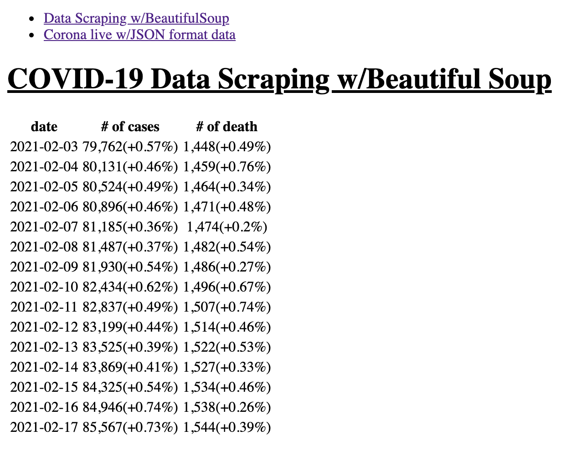

## **<ins>Data Scrapping Practice - COVID-19 Data</ins>**

 

    

 

**목표 : <ins>웹 페이지의 정보 중에서 필요한 데이터를 Beautiful Soup을 활용하여 Scrapping한다.</ins>**

**Practice 1)** Wikipedia의 한국 COVID-19 정보 페이지에서 필요한 정보를 Scrapping한다.  
https://en.wikipedia.org/wiki/COVID-19_pandemic_in_South_Korea

 

**목표 : <ins>Web API의 JSON형식의 데이터를 읽고 가공한다.</ins>**

**Practice 2)** JSON 형식의 데이터를 읽고 필요한 데이터를 추출을 위해 가공한다.  
https://apiv2.corona-live.com/updates.json?timestamp=1613547340934

 

# **Project Status**

🗓️ 2021.02.18(Thu)  
**(1) Issue1)** Flask 프로젝트의 기본 환경구축  
→ [https://github.com/LeeHyungi0622/simple-covid19-flask-app/issues/1](https://github.com/LeeHyungi0622/simple-covid19-flask-app/issues/1)  

**(2) Issue2)** Wikipedia 웹 페이지에서 필요한 정보를 Scraping한다.  
→ [https://github.com/LeeHyungi0622/simple-covid19-flask-app/issues/2](https://github.com/LeeHyungi0622/simple-covid19-flask-app/issues/2)  

**(3) Issue3)** Web API의 JSON형식의 데이터를 읽고 가공한다.  
→ [https://github.com/LeeHyungi0622/simple-covid19-flask-app/issues/3](https://github.com/LeeHyungi0622/simple-covid19-flask-app/issues/3)

## **Screen shots**

`(static/style.css) Flask에서 업데이트된 CSS 스타일 적용이 잘 안되서 적용안된 데이터 출력 캡쳐만 첨부합니다.`

<table>
    <tr>
        <td>
            
        </td>
        <td>
            
        </td>
    </tr>
    <tr>
        <td align="center"><b>Practice 1</b></td>
        <td align="center"><b>Practice 2</b></td>
    </tr>
</table>
